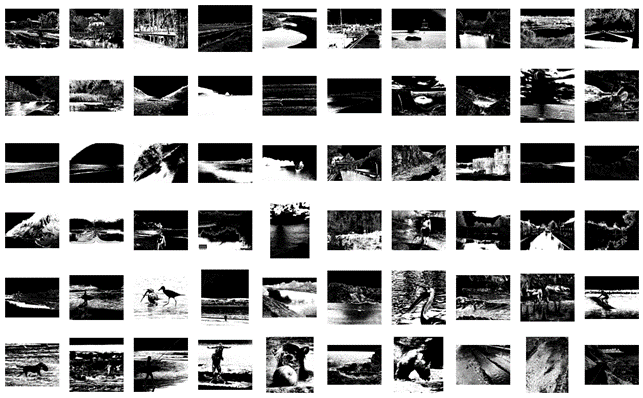
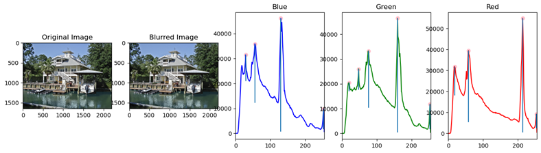
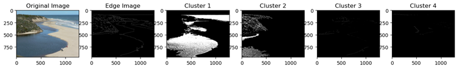
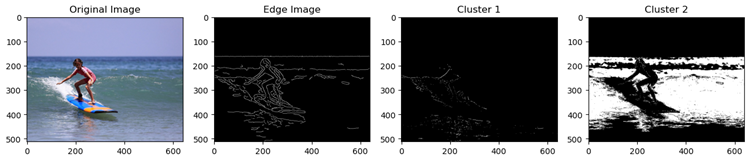
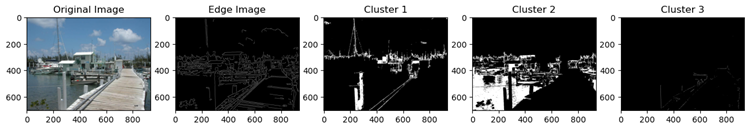
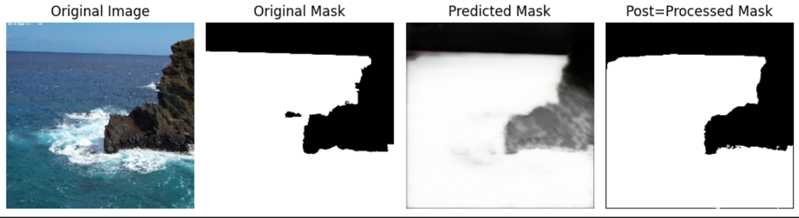

# DIP Final Project: Water_segmentation

## Problem description

There are only 60 water images with corresponding segmentation mask. We can use traditional-based method (Machine Learning, Image processing, etc.) or deep learning-based method to segment the water region.

## Our Method

### ML-based

#### Workflow

1. **Color analysis:** We think the color of water region have a specific pattern, that is, the RGB values will be in a certain range. First, we find the region of interesting (ROI) images using mask image. Then, calculate the pixel value distribution of each channel to find the mean and standard. Finally, we generate the color mask by first standard of distribution to cancel out the uncorrelated color region.

2. **K-means clustering:** We use K-means clustering to preliminarily segment the image in color space. To decide how much cluster needed, we look into how much distribution in the histogram of each channel by searching for the distant peak.

3. **Connected component analysis:** We found that water region in almost every image are expansive area, so we can cancel out the small region in each cluster to avoid the false positive. Before doing the connected component analysis, we substract each clustering result by the edge feature obtained by Canny edge algorithm. The reason is that we think the edge features can cut out the different items or region in images, so it benefits to divide each refion in clustering results.
4. **Color masking:** After all the processing, we do the color masking by the color mask generating in first step.

#### Results

### DL-based

#### Workflow

1. **Data augmentation:** We use `Random flipped`, `Scaling`, `Rotate` to generate 240 augment images, and find other 300 images from web.
2. **Train Hyperparameter:** `Batch size: 16`, `Epoch: 45`

#### Results

